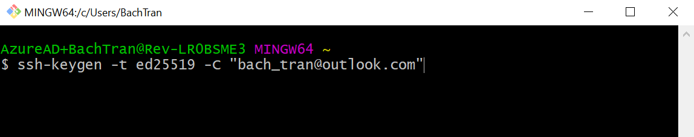
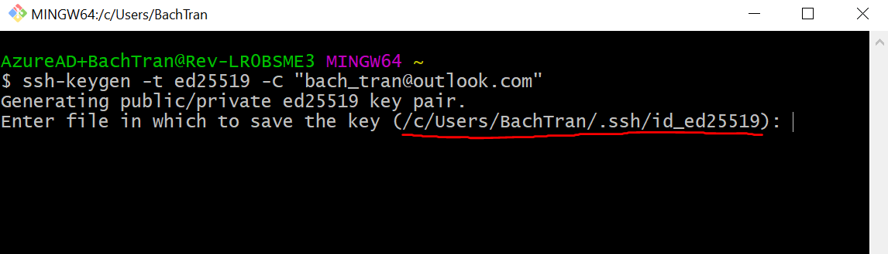
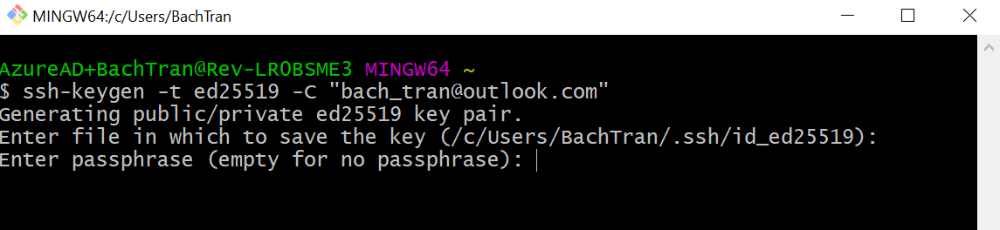
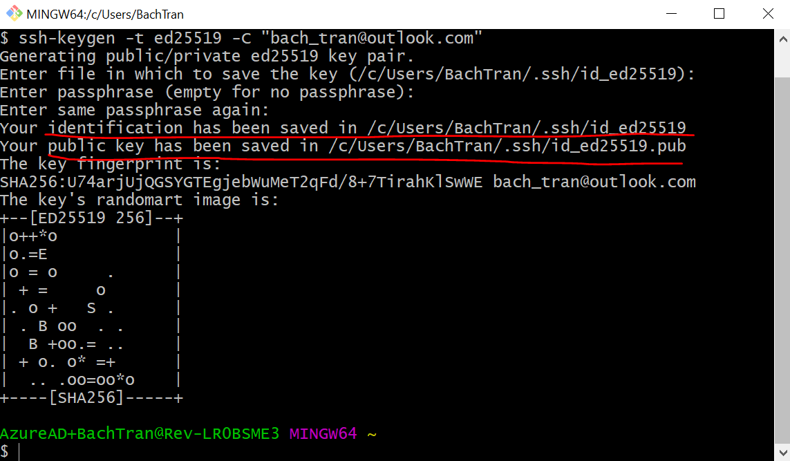
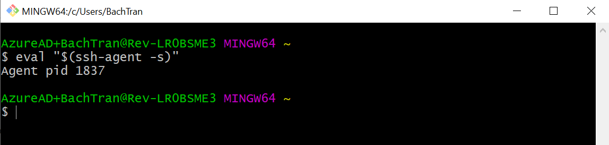
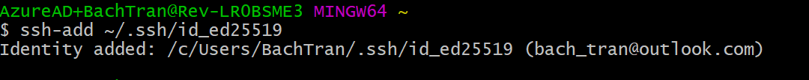
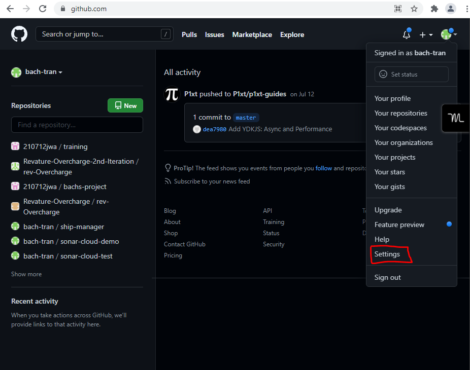
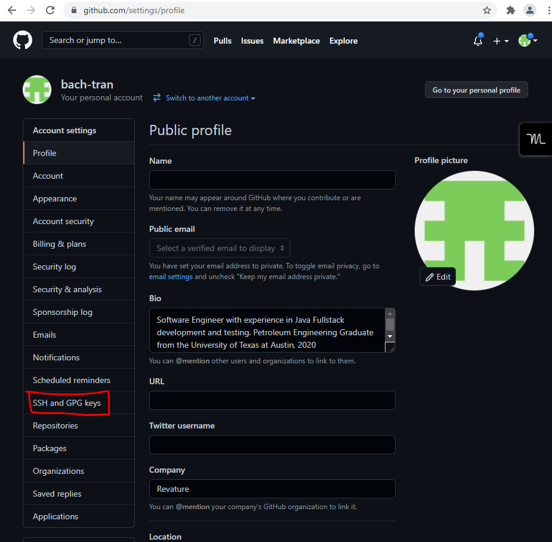
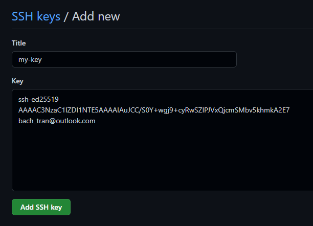
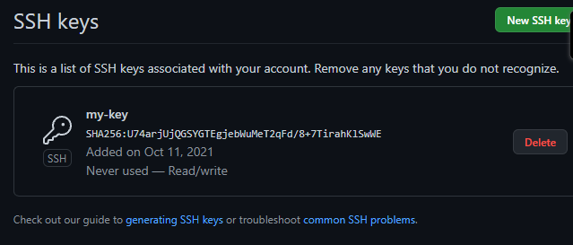

# Setting up SSH Key authentication

In order to authenticate your Git bash program with the account you created on Github so that you can push to repositories you create, you need to utilize SSH authentication. SSH authentication is not performed using a username and password, but rather using **asymetric key pairs**. The following are the keys that need to be generated:

1. Public key: used by the server to encrypt a message to send to the client
2. Private key: used by the client to decrypt the message and send back to the server for verification

Conceptually, 
- Server = Github
- Client = Git Bash

# Steps
1. Generate the public-private key pair by running the following command in Git Bash. You should substitute your Github email address.
```bash
ssh-keygen -t ed25519 -C "your_email@example.com"
```


2. Once you press enter, it will prompt you to enter the file in which to save the key. Just use the default value here, but note the location the key is being saved to.


3. Keep the passphrase empty and press enter twice


4. You should see output that looks similar to below. 


Note that two files and their locations are indicated in the output:
- id_ed25519 = PRIVATE KEY
- id_ed25519.pub = PUBLIC KEY

5. To ensure that the key is registered with Git bash (although in most cases this is done automatically), run the following command:
```bash
eval "$(ssh-agent -s)"
```


It will start up the ssh-agent, which allows us to manage the ssh keys being used on our system.


6. Add the private key that was generated to the ssh-agent

```bash
ssh-add ~/.ssh/id_ed25519
```


7. In order to link our keys with our Github account, we need to login on [github](https://github.com/). Click to the top right, in within the dropdown, select settings.



8. Click on `SSH and GPG keys`, then click on `New SSH key`.



9. You will then need to copy and paste the contents of the public key file into the dialog box. Navigate to the location of id_ed25519.pub, open the file using VS Code or Notepad, and copy and paste all of its contents. For the title, give it any name you want.



10. Your key should now be added, and you should have no issues authenticating with your Github account from Git Bash!

